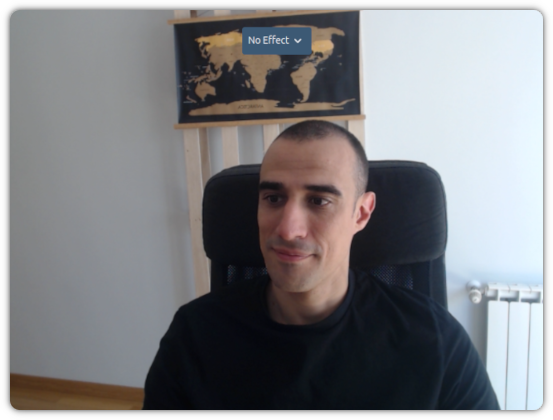
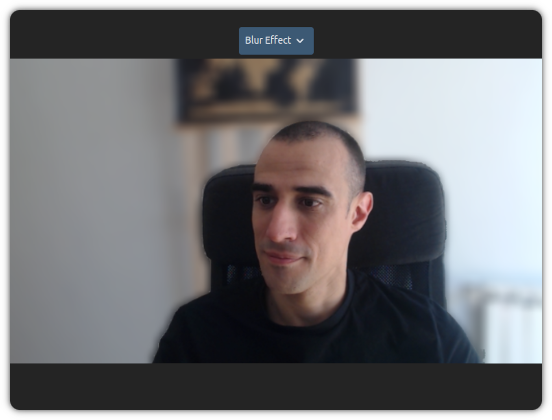
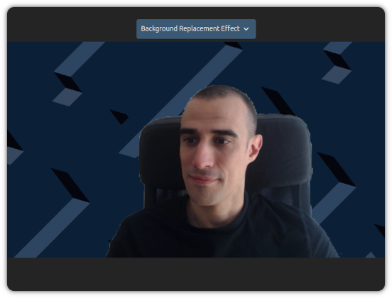

# Media Processor Example

Angular example of the package `@pexip/media-processor`. In this example you will see how to apply different effects to a
live video.

We use `getUserMedia` to get the camera feed and we display it into a `<video>` element.

## How to use

In this demo we will have a selector to choose the effect that we want to apply. By default `No Effect` is selected, so
you will see the original camera feed:

<div align='center'>



</div>

If you change the selector to `Blur` the selfie segmentation will be applied and you will see that the background is
blurred.

<div align='center'>



</div>

Finally, if you select `Background Replacement Effect`, you will see that the background is changed for the image
located in `public/backgrounds/background.png`.

<div align='center'>



</div>

## Run for development

- To be able to build the plugin, you need to comply with the following versions or higher:

  | NodeJS   | NPM     |
  | -------- | ------- |
  | v20.12.2 | v10.5.0 |

- Install all the dependencies:

  ```bash
  $ npm i
  ```

- Run the dev environment:

  ```bash
  $ npm start
  ```

The example will be served from http://localhost:4200.

## Build for production

To create a package, you will need to first install all the dependencies:

```bash
$ npm i
```

And now to create the package itself:

```bash
$ npm run build
```

## Update the segmentation files

Some files should be served from the public folder. If you want to update them, run the following command:

```
$ npm run update-selfie-segmenter
```
